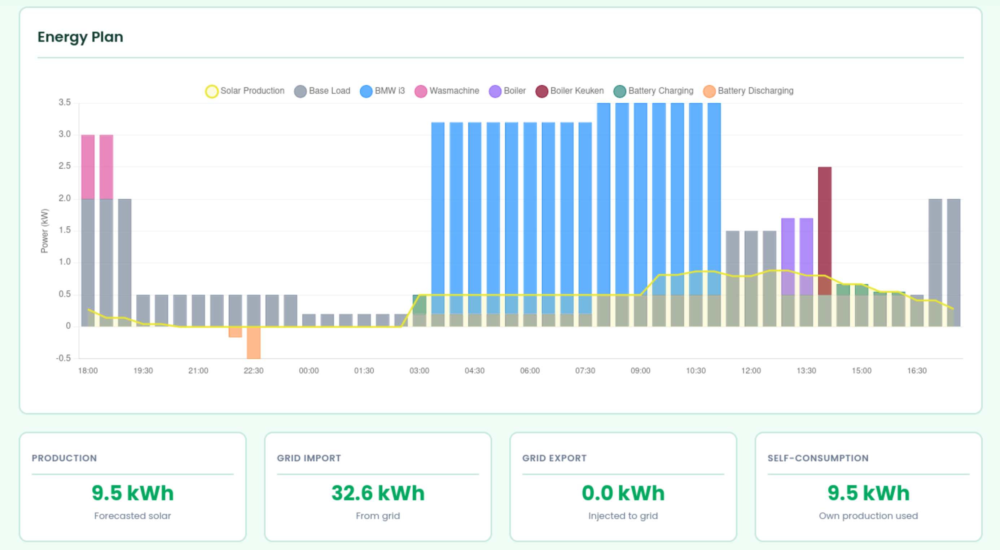

# GridMate for Home Assistant

Home energy management system with Home Assistant & EMHASS at its heart. 

## Introduction
GridMate is an energy management system that leverages Home Assistant's 
existing ecosystem of integrations. It aims to bring together commonly 
used energy management tools such as live P1 meter readings, EMHASS for optimization of deferred energy 
loads, Solcast or Forecast.solar for solar predictions, Nord Pool for energy prices, ...
with easy configuration steps and user friendly dashboards without the need for
too much tinkering with custom logic or dashboards. 



## Installation

[](https://my.home-assistant.io/redirect/supervisor_store/?repository_url=https%3A%2F%2Fgithub.com%2Fgridmate%2Fgridmate)

Or manually:
1. In Home Assistant go to **Settings → Add-ons → Add-on Store**
2. Click the three dots in the top right and select **Repositories**
3. Add this repository URL: `https://github.com/lennertcl/gridmate`
4. Find **GridMate** in the store and click **Install**
5. In the addon **Configuration** tab, set your **Home Assistant Token** (long-lived access token)
6. Start the addon — it will appear as a panel in the sidebar

## Features
- Energy invoice insights and cost breakdown
  * Configure GridMate based on your energy contract to minimize your energy bill. 
  * Get an estimation of your energy bill for each month/year based on 
  your usage and contract. 
  * Get insights on which elements of your energy contract and usage contribute the most 
  to your bill. 
- Solar panel management & dashboard
  * Configure your solar panel installation and use its data to optimize energy 
  usage and planning of deferrable loads. 
  * Integrate with any third party tool like Solcast for solar panel predictions 
  for more accurate load planning. 
- Home battery management & dashboard
  * Configure your home battery installation and get insights on how and when it's used. 
  * (PLANNED) GridMate determines when to charge and discharge home batteries for maximum 
    energy efficiency and minimum cost. Or charge your battery when energy is 
    cheap and discharge when it's expensive.
  * (PLANNED) Integrate with a third party tool like PredBat for optimized planning.
- Schedule your smart devices
  * Link any Home Assistant devices to Gridmate with common interfaces to steer any deferrable
    load device directly based on simple configuration settings. 

## Quick Start
### Prerequisites

- A running [Home Assistant](https://www.home-assistant.io/) instance with Supervisor (HAOS or Supervised install)
- Devices added to Home Assistant: solar panels, home battery, EV, ...
- Energy usage data flowing into HA via a smart meter or integration ([HA electricity grid docs](https://www.home-assistant.io/docs/energy/electricity-grid/))

### Configuration
1. Energy Feed: 
The energy feed is the interface used to link your energy grid consumption and 
injection data to GridMate. 
2. Devices: 
Link your Home Assistant to GridMate using existing Device Types. Device Types
are common interfaces that allow e.g. scheduling a device or showing specific
data from it on a dashboard (e.g.: Electric Vehicle, Home Battery). 
3. Solar Panels: 
Link your solar panels and solar forecaster from Home Assistant. 
4. Energy Contract: 
Configure your energy contract details in terms of components to show a detailed costs breakdown. 
5. Optimization: 
Configure your optimization preferences and schedule. 

## Recommended Integrations

| Integration | Description | Link |
|---|---|---|
| EMHASS | Energy management optimization engine | [GitHub](https://github.com/davidusb-geek/emhass) |
| Predbat | Home battery prediction and control | [GitHub](https://github.com/springfall2008/batpred) |
| Solcast | Solar forecasting | [solcast.com](https://solcast.com/) |
| forecast.solar | Solar forecasting | [forecast.solar](https://forecast.solar/) |
| Nord Pool | Electricity prices | [GitHub](https://github.com/custom-components/nordpool)

## Development

Pull requests are welcome. Feature requests can be filed as issues.

AI-assisted development is encouraged, most of the code in the project is written by AI. 
Yes, there is definitely some AI code which I aim to cleanup (at some point..). 
Try to keep contributions well thought through. 
Use prompts, skills, and rules in your `.github/` to guide your AI agents — and have them read the `docs/` folder before making changes.
The main prompt [implement-with-rules](.github/prompts/implement-with-rules.prompt.md) was used extensively for creating this project. 

### Local setup

```bash
# Clone and set up
git clone <repo-url> && cd addon
python -m venv venv && source venv/bin/activate
pip install -r requirements.txt

# Configure environment
cp .env.example .env
# Edit .env with your HA_URL and HA_TOKEN

# Run
flask --app app.py --debug run
```

### Deploy dev version to Home Assistant

Use the [deploy.sh](deploy.sh) script to copy files to your HA instance via Samba:

```bash
./deploy.sh
```

Then in HA go to **Settings → Add-ons → Add-on Store → Local add-ons** and install/restart GridMate.

## Feature requests

Feature requests are very welcome, please create a Github issue for them. 
I know that the current project was created as a personal tool with only 
my personal energy management needs in mind, e.g. complex (Belgian) energy 
contracts. Will happily extend to suit other needs.

## Documentation

Limited technical documentation (written by AI, and mostly for AI) lives in the 
[`docs/`](docs/) folder. 

## License

AGPLV3, see [LICENSE](LICENSE).
